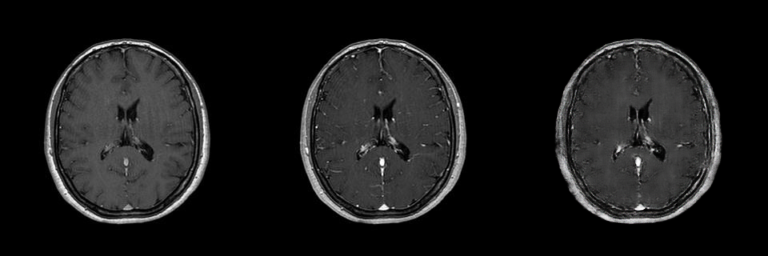
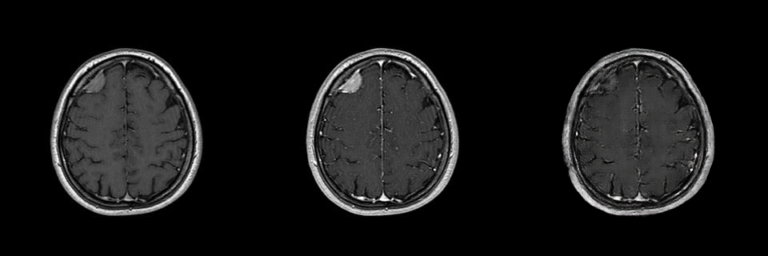
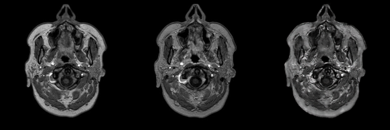
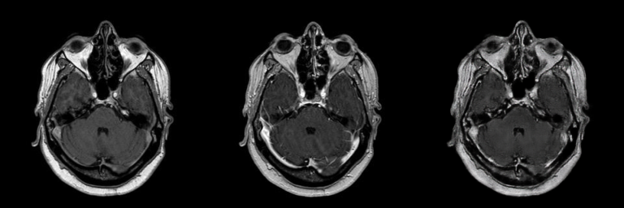

<<<<<<< HEAD
=======
# Low-Dose to Standard-Dose Brain MRI Synthesis Using Pix2Pix

A PyTorch implementation of a conditional Generative Adversarial Network based on **Pix2Pix** for synthesizing standard-dose contrast-enhanced brain MRI images from scans acquired using approximately **20% of the standard gadolinium contrast dose**.

The model receives a low-dose contrast-enhanced MRI slice as input and generates a synthetic image intended to resemble the corresponding standard-dose contrast-enhanced MRI.

> **Important:** The generated images are synthetic research outputs and must not be interpreted as actual standard-dose MRI acquisitions or used for clinical diagnosis.

---

## Overview

Gadolinium-based contrast agents can improve the visibility of tumors, lesions, vascular structures, and abnormal tissue enhancement in brain MRI. However, reducing contrast-agent exposure may be desirable in some imaging scenarios.

This project investigates whether a paired image-to-image translation model can learn the mapping:

```text
20% gadolinium-dose brain MRI
                ↓
             Pix2Pix
                ↓
Synthetic standard-dose-like brain MRI
```

A conditional GAN is trained using paired low-dose and standard-dose MRI slices. The generator attempts to reconstruct the appearance of the standard-dose image, while the discriminator evaluates whether the generated image is visually consistent with the input and resembles a real standard-dose scan.

---

## Key Features

* Paired low-dose and standard-dose brain MRI translation
* PyTorch implementation
* Conditional Pix2Pix architecture
* Compact U-Net generator with skip connections
* PatchGAN discriminator
* Combined adversarial and L1 reconstruction loss
* Patient-aware image pairing
* Automatic model checkpointing
* Quantitative evaluation using Structural Similarity Index Measure
* Qualitative comparison of input, ground truth, and generated images

---

## Image Translation Task

The dataset is organized into two image domains:

| Domain | Description                                                                |
| ------ | -------------------------------------------------------------------------- |
| `A`    | Brain MRI acquired using approximately 20% of the standard gadolinium dose |
| `B`    | Corresponding brain MRI acquired using the standard gadolinium dose        |

The model learns the following translation:

```text
A → B
```

where:

```text
A = 20% gadolinium-dose MRI
B = real standard-dose MRI
G(A) = AI-generated standard-dose-like MRI
```

---

## Dataset

The source dataset contains paired brain MRI scans from approximately **8 patients**.

In the current notebook configuration, the processed dataset contains:

| Split      | Number of paired slices |
| ---------- | ----------------------: |
| Training   |                   1,500 |
| Validation |                     500 |
| Total      |                   2,000 |

Each low-dose MRI slice is paired with its corresponding standard-dose MRI slice.

The dataset itself is not included in this repository because medical imaging data may be subject to privacy, ethical, institutional, and licensing restrictions.

### Expected Dataset Structure

```text
pix2pix_dataset/
├── train/
│   ├── A/
│   │   ├── patient0_*.jpg
│   │   ├── patient1_*.jpg
│   │   └── ...
│   └── B/
│       ├── patient0_*.jpg
│       ├── patient1_*.jpg
│       └── ...
└── val/
    ├── A/
    │   ├── patient0_*.jpg
    │   └── ...
    └── B/
        ├── patient0_*.jpg
        └── ...
```

The custom dataset class groups images by patient identifier and creates paired samples from the common patients found in domains `A` and `B`.

---

## Model Architecture

The project uses a conditional GAN based on the Pix2Pix framework.

### Generator

The generator is a compact **U-Net-style convolutional neural network**.

Its main components are:

* Three convolutional downsampling blocks
* Three transposed-convolution upsampling blocks
* Skip connections between corresponding encoder and decoder layers
* Batch normalization
* Leaky ReLU activations in the encoder
* ReLU activations in the decoder
* A final `Tanh` activation

The skip connections help preserve anatomical and spatial information while the network learns the contrast-enhancement transformation.

### Discriminator

The discriminator is a conditional **PatchGAN** network.

It receives the concatenation of:

```text
Low-dose input MRI + Real or generated standard-dose MRI
```

The concatenated tensor contains six channels:

```text
3 input channels + 3 target/generated channels
```

Instead of producing a single global real-or-fake score, PatchGAN evaluates local image patches. This encourages the generator to reproduce local texture, edges, anatomical structures, and contrast-enhancement patterns.

---

## Training Objective

The generator is optimized using a combination of adversarial loss and pixel-level reconstruction loss.

```text
Generator Loss = Adversarial Loss + λ × L1 Loss
```

where:

* **Adversarial loss** encourages realistic standard-dose-like outputs.
* **L1 loss** encourages similarity between the generated image and the real standard-dose target.
* `λ = 100` controls the contribution of the L1 reconstruction loss.

Binary cross-entropy loss is used for adversarial training.

---

## Training Configuration

| Parameter                   |                Value |
| --------------------------- | -------------------: |
| Framework                   |              PyTorch |
| Image size                  |            256 × 256 |
| Input channels              |                    3 |
| Output channels             |                    3 |
| Batch size                  |                    4 |
| Number of epochs            |                   60 |
| Generator learning rate     |               0.0002 |
| Discriminator learning rate |               0.0002 |
| Adam β₁                     |                  0.5 |
| Adam β₂                     |                0.999 |
| L1 loss weight              |                  100 |
| GAN loss                    | Binary cross-entropy |
| Reconstruction loss         |              L1 loss |
| Hardware                    |  CUDA-compatible GPU |

The images are normalized from `[0, 1]` to `[-1, 1]` before being passed to the networks.

Generator and discriminator checkpoints are saved every ten epochs.

---

## Evaluation

The generated images are evaluated using the **Structural Similarity Index Measure**, or SSIM.

SSIM compares the structural similarity between the generated image and its corresponding real standard-dose MRI.

### Validation Results

| Metric                       |     Result |
| ---------------------------- | ---------: |
| Average SSIM                 | **0.8615** |
| Maximum SSIM                 | **0.9857** |
| Best validation sample index |    **155** |

These values indicate a high visual and structural similarity on the processed validation set. However, SSIM alone does not establish diagnostic equivalence or clinical safety.

Additional evaluation should include:

* Peak Signal-to-Noise Ratio
* Mean Absolute Error
* Mean Squared Error
* Region-based analysis
* Lesion-level assessment
* Contrast-enhancement measurements
* Radiologist evaluation
* External multi-center validation

---

## Qualitative Results

Each result image contains three panels arranged from left to right:

| Position | Image                                                |
| -------- | ---------------------------------------------------- |
| Left     | Input MRI acquired using 20% gadolinium dose         |
| Center   | Real MRI acquired using the standard gadolinium dose |
| Right    | AI-generated standard-dose-like MRI                  |

### Sample 1

<p align="center">
  
</p>

### Sample 2

<p align="center">
  
</p>

### Sample 3

<p align="center">
  
</p>

### Sample 4

<p align="center">
  
</p>

The generated panel should be interpreted as a model prediction rather than a true MRI scan acquired after administering the standard gadolinium dose.

---

## Repository Structure

```text
low-dose-mri-to-standard-dose-pix2pix/
├── low_dose_to_standard_dose_brain_mri_pix2pix.ipynb
├── output/
│   ├── sample1.png
│   ├── sample2.png
│   ├── sample3.png
│   └── sample4.png
├── README.md
└── .gitignore
```

The dataset and trained model files are not necessarily included in the repository because of their size and possible data-access restrictions.

---

## Requirements

The project requires Python 3 and the following packages:

```text
torch
torchvision
numpy
matplotlib
Pillow
scikit-image
```

Install the dependencies using:

```bash
pip install torch torchvision numpy matplotlib pillow scikit-image
```

A CUDA-compatible GPU is strongly recommended for training.

---

## Running the Notebook

### 1. Clone the repository

```bash
git clone https://github.com/mohammadmolavi/low-dose-mri-to-standard-dose-pix2pix.git
cd low-dose-mri-to-standard-dose-pix2pix
```

Replace `USERNAME` with the GitHub username of the repository owner.

### 2. Open the notebook

The notebook is designed to run in Google Colab or another Jupyter-compatible environment.

```text
low_dose_to_standard_dose_brain_mri_pix2pix.ipynb
```

### 3. Prepare the dataset

Place the paired dataset in the expected directory structure:

```text
pix2pix_dataset/train/A
pix2pix_dataset/train/B
pix2pix_dataset/val/A
pix2pix_dataset/val/B
```

In the current Colab implementation, the compressed dataset is loaded from Google Drive:

```text
/content/drive/MyDrive/MRI/pix2pix_dataset.zip
```

Update this path when the dataset is stored in another location.

### 4. Run the notebook cells

Execute the notebook cells in order to:

1. Mount Google Drive
2. Extract the dataset
3. construct the paired datasets
4. Initialize the data loaders
5. Define the generator and discriminator
6. Train the Pix2Pix model
7. Save model checkpoints
8. Evaluate the final generator using SSIM
9. Export qualitative result images

---

## Model Checkpoints

The training process creates the following model files:

```text
best_generator.pth
generator_final.pth
generator_epoch_10.pth
generator_epoch_20.pth
generator_epoch_30.pth
generator_epoch_40.pth
generator_epoch_50.pth
generator_epoch_60.pth
```

Corresponding discriminator checkpoints are also saved every ten epochs.

Large checkpoint files should generally be excluded from Git using `.gitignore` or distributed through Git LFS or a separate model-hosting service.

---

## Suggested `.gitignore`

```gitignore
# Python
__pycache__/
*.py[cod]
.ipynb_checkpoints/

# Datasets
pix2pix_dataset/
*.zip

# Model checkpoints
*.pth
*.pt
*.ckpt

# Generated training samples
epoch_*_train_sample.png

# System files
.DS_Store
Thumbs.db
```

Remove the `*.pth` rule when a small trained checkpoint is intentionally included in the repository.

---

## Limitations

This project has several important limitations:

1. The generated image may introduce artificial enhancement patterns.
2. The model may suppress, distort, or hallucinate clinically relevant structures.
3. High SSIM does not guarantee preservation of tumor boundaries or pathological findings.
4. Performance may decrease on images acquired using different scanners, protocols, magnetic-field strengths, or institutions.
5. Sequential pairing requires accurate alignment between low-dose and standard-dose slices.
6. The current implementation processes MRI images as three-channel RGB images.
7. The model has not been validated for diagnostic or treatment-planning use.
8. Clinical evaluation by qualified radiologists is required before any medical application.

---

## Medical and Ethical Disclaimer

This repository is intended exclusively for:

* Machine-learning research
* Medical image synthesis experiments
* Educational use
* Academic evaluation

It is **not a medical device** and is **not intended for clinical diagnosis, treatment planning, patient management, or replacement of contrast-enhanced MRI acquisition**.

AI-generated medical images may contain visually plausible but medically incorrect information. Any clinical interpretation must be based on original medical imaging data and performed by qualified healthcare professionals.

---

## Future Work

Potential improvements include:

* Using a deeper U-Net architecture
* Processing original grayscale or DICOM data
* Adding perceptual or feature-matching losses
* Adding PSNR, MAE, MSE, and LPIPS evaluation
* Performing lesion-specific evaluation
* Evaluating enhancement within tumor regions
* Adding segmentation-guided training
* Testing attention-based generators
* Comparing Pix2Pix with CycleGAN and diffusion models
* Performing patient-level cross-validation
* Evaluating the model on external datasets
* Conducting blinded radiologist assessment
* Preserving acquisition metadata and intensity calibration

---

## Reference

This implementation is based on the Pix2Pix image-to-image translation framework introduced in:

> Phillip Isola, Jun-Yan Zhu, Tinghui Zhou, and Alexei A. Efros.
> *Image-to-Image Translation with Conditional Adversarial Networks.*
> CVPR, 2017.

---

## Author

**Mohammad Molavi**

---

## Acknowledgment

This project was developed as a research-oriented experiment in conditional generative modeling for reduced-dose contrast-enhanced brain MRI synthesis.

>>>>>>> a375aed (docs: add README, notebook, and qualitative MRI synthesis results)
